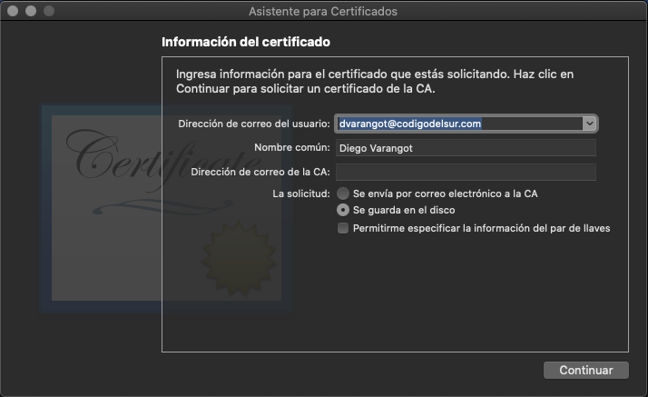

----------------------
iOS Push Notifications
----------------------

All the apps reach a moment when they need to send Push Notifications. Follow this guide to configure your app and use this code to test your configuration.

Steps:

    1. Bundle Identifier
    2. Capabilites
    3. Provissioning Profiles
    4. APN certificate/Key
    5. Hands-on (coding)
    6. Test

-------------------------
1. Bundle Identifier
-------------------------

Push notifications are tied to the App's unique identifier, the  [Bundle Identifier](https://developer.apple.com/documentation/appstoreconnectapi/bundle_ids). So, if you don't have registered one yet you will need to register one in your Apple's [Developer Account](https://developer.apple.com/programs/how-it-works/) ([Register Bundle Identifier Guide](https://support.staffbase.com/hc/en-us/articles/115003535352-Creating-the-iOS-App-ID))


-----------------------
2. Capabilities
-----------------------

Now that you have an App ID (Bundle Identifier), you need to go to your Developer Account and enable Push Notifications for your App. To enable PN you need to find your app's capabilities, so, go to your App ID configuration by selecting your App ID from your [Identifiers list](https://developer.apple.com/account/resources/identifiers/list). Inside you will find all your app Capabilites listed, enable PN.

<p align="center">
  
</p>

---------
3. Provissioning Profiles
---------
Provissioning Profiles have Capabilites, so if you change/add a capability in your app, you will probably need to update/re-generat your provissioning profile.
Go to your [list of Profiles](https://developer.apple.com/account/resources/profiles/list) and update them. You will need to download and install them in your local environment again.

---------
4. APN certificate / Key
---------
In order for a third party or backend to be able to send PN to your devices, you will need to generate a certificate / key. We will first explain how to generate the certificate and then how to generate a key and what is the difference between both.

A. Certificate

    1. Generate a Certificate Signing Request (CSR)
    2. Create an APNS Certificate
    3. Convert to PEM
    4. Validate
    5. Add certificate file to project

A1. Generate a Certificate Signing Request (CSR)

Open the Keychain Access and select Request a Certificate from a Certificate Authority a the image shows.
<p align="center">
  
</p>

Then provide a Common Name and select "Saved to disk" as the image shows.

<p align="center">
  
</p>

A2. Create an APNS Certificate

Go to the [Certificate list](https://developer.apple.com/account/resources/certificates/list) and select to add a new one. In the service section, select Apple Push Notifcation sevice SSL (Sandbox & Production), note this certificate will be used for both DEBUG and RELEASE for only one App ID.

<p align="center">
  
</p>

Then you will need to select your app from the list and continue untill the certificate is generated.

<p align="center">
  
</p>

Finally download the certificate and install it in local machine.

A3. Convert to PEM

Now that the certificate is installed you need to generate the .p12 file and then generate the .pem file. Open the Keychain Access, select the APN certificate, open the options and select export.

<p align="center">
  
</p>

Once you have generated the .p12 file you need to run this on the terminal to generate the .pem file that you will use to send PN.
```zsh
$ openssl pkcs12 -in <cert_name_goes_here>.p12 -out <pem_name_goes_here>.pem -nodes
Enter Import Password:
MAC verified OK
```

You have to do the same process for you provate key, and generate the .pem file.

<p align="center">
  
</p>

A4. Validate

To validate the content of your .pem file you can check it [here]
(https://www.sslshopper.com/certificate-decoder.html)

A5. Add certificate file to project

Put both .pem files in the root folder of this proyect and you are ready to test.

---------
5. Hands-on
---------

Now you need to prepare your app to receibe PN. For now follow [this](https://www.raywenderlich.com/8164-push-notifications-tutorial-getting-started) tutorial to complete this section.

---------
6. Test
---------
6.1. Clone the repo

6.2. Run
```shell
$ npm install
```
6.3. Populate all the vars in the .env file
6.4. Run
```shell
$ node testAPN.js
```